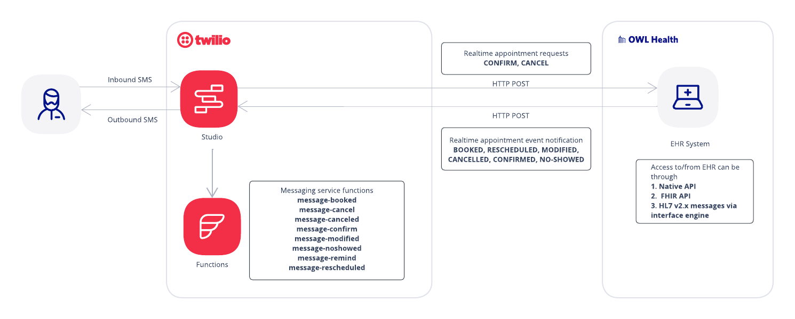

# Appointment Management with EHR Integration App: Technical Guide

*This document is intended to serve as a technical guide for customers who are interested in the architecture of the Appointment Management with EHR Integration application, and for understanding installation and customization possibilities.*

*Installation of this application is supported using the latest versions of Chrome and Firefox. Installation via Internet Explorer has not been officially tested and although issues are not expected, unforeseen problems may occur.*

## Application Overview

***

***

The Appointment Management with EHR Integration app packages together the core components of a deployable prototype for basic, two-way SMS communication between patient and provider using appointment information that is shared between the application and an integrated [Electronic Health Record (EHR)](https://www.healthit.gov/faq/what-electronic-health-record-ehr). This app is intended to support healthcare providers who are interested in building their own appointment management solution to understand what is possible using Twilio, and to accelerate the path to success by providing core building blocks and necessary workflows for implementing SMS appointment communication such as scheduling confirmations, reminders and cancelations.

The application includes the necessary Twilio components and an appointment reminder scheduling service, all pre-configured for deployment of a working prototype, ready to integrate directly with an EHR for demonstration of the possibilities (the separate step of EHR integration is required for the app to work). This application is not intended to be a production-ready app, but rather will allow you to install a functioning prototype into your test environment, establish a working EHR integration, and to explore how different Twilio components and functions can be leveraged to meet your needs.

Specifically, the Appointment Management with EHR Integration application implements the following capabilities:

- (*Outbound*) SMS notifications sent to patients based on appointment events occurring in the EHR:
  - booking/scheduling
  - rescheduling (date/time changes)
  - modification (location and/or provider)
  - confirmation
  - cancellation
  - noshows

- (*Inbound*) SMS response sent from patient "to the provider" (technically, to the EHR)
  - confirmation request
  - cancellation request

- (*Outbound*) SMS reminders sent to patient based on scheduled appointments (up to 2 reminders per patient per day)

*(For more details on appointment events supported by this application
, please reference the [EHR Integration Guide](https://twilio-cms-prod.s3.amazonaws.com/documents/EHR_Appointment_Management_App_EHR_Integration_Guide.pdf))*

## Architecture Highlights

***

***

This section provides a high-level overview of the application's architecture, including a discussion of the baked-in application components, the EHR integration that is necessary for the app to function, and an  Architecture diagram.

***

***
### Application Components

***

The application's architecture consists of 3 main components that interact closely together: Twilio Studio Flow, Twilio Functions.
- **Twilio Studio Flow** implements the SMS interaction with the patient (i.e. customizable message text and workflow) by taking configured parameters (from both the EHR messages and from your preferred message details configured in the Flow itself) and sending appropriate messages.
- **Twilio Functions** collect appointment events from the EHR and send sms

### EHR Integration

***

This application is intended to sit next to your EHR, and will rely on a near real-time EHR integration interface coupled with the application's components, in order to function.  As long as your EHR integration interface can facilitate the real-time data exchange with the EHR, the app can integrate with a variety of integration methods including HL7 v2 messaging, FHIR, native EHR APIs, or available third-party integration APIs. Once scheduling messages are received by Twilio from your EHR, they are converted into JSON to complete the information flow through Twilio.

## Architecture Details

This section takes a deeper dive into the application's architecture by outlining the specific assets that are included in the app, what each of the application's components do, the functions and resources that are leveraged, as well as describing how events and dispositions are used to maintain appropriate appointment states within the system.

### Application Components

***

Below is a description of each of the components that you will find baked into the application (including Twilio c).

#### Twilio Studio Flow

This application includes a preconfigured Twilio Studio Flow, which implements:

- SMS interaction (outbound & inbound) with the patient per appointment event occurrence
- Scheduling and Sending messages
- Communicating to your EHR endpoint for 2-way (inbound to EHR) appointment requests (such as appointment cancelation & appointment confirmation requests)

*For more information on how the Studio Flow component works, check out [Twilio Studio Documentation](https://www.twilio.com/docs/studio).*

#### Twilio Service (Assets & Functions)
The application leverages service assets and functions
, which are part of Twilio Runtime.
Check out [Twilio Runtime Documentation](https://www.twilio.com/docs/runtime)
for additional information.

#### Assets
Static assets (files) of the application:

| Asset (under `/assets`) | Description |
| :-----------------------| :---------- |
|`/controller.js` |Javascript functions that control application behavior from `index.html`|
|`/authentication-controller.js` |Javascript functions that control application authentication|
|`/index.html` |Main application page for application user|
|`/studio-flow-template.json` |Deployable Studio Flow template|
|`/style.css` |Stylesheet used in `index.html`|
|`images/architecture.png` |Technical architecture diagram|
|`images/token-flow.png` |MFA-based token flow diagram|
|`installer/index.html` |Helper page for deployment of application|
|`installer/installer-controller.js` |Javascript functions that control application behavior from `installer/index.html`|
|`installer/installer.css` |Stylesheet used in `installer/index.html`|

#### Functions
Functions used in the application:

| Functions (under `/functions`) | Description |
| :----------------------------- | :---------- |
|`/auth.js` |Checks authorization|
|`/get-datetime-parts.js` |Returns multiple datetime parts from ISO8601 string|
|`/helpers.js` |Shared functions used by other functions|
|`/scheduled-message-helper.js` |Helper functions used for message scheduling|
|`/login.js` |Handles login from `index.html` page|
|`/mfa.js` |Handles MFA logic from `index.html` page|
|`/refresh-token.js` | Provides updated token periodically to `index.html` page|
|`/message-booked.js` |Triggers booked appointment notification event|
|`/message-cancel.js` |Triggers cancel appointment request event|
|`/message-canceled.js` |Triggers canceled appointment notification event|
|`/message-confirm.js` |Triggers confirm appointment request event|
|`/message-confirmed.js` |Triggers confirmed appointment notification event|
|`/message-modified.js` |Triggers modified appointment notification event|
|`/message-noshowed.js` |Triggers noshowed appointment notification event|
|`/message-opted-out.js` |Triggers opted-out appointment notification event|
|`/message-remind.js` |Triggers appointment reminder event|
|`/message-rescheduled.js` |Triggers rescheduled appointment notification event|
|`installer/check-studio-flow.js` |Checks deployment state of Twilio Studio Flow|
|`installer/check-application.js` |Checks deployment state of the application|
|`installer/get-application.js` |Get state of the deployed application|
|`installer/deploy-studio-flow.js` |Deploys Twilio Studio Flow|
|`installer/deploy-application.js` |Deploy Twilio services|
|`installer/deploy-messaging-service.js` |Deploy Twilio Messaging Service|
|`installer/delete-service.js` |Delete existing services of the application|
|`deployment/simulation-parameters.js` |Gets customer parameters for display in simulation page |
|`deployment/simulation-event.js` | Simulates events in the simulation page |
|`deployment/test-deployment.js` |Executes tests post deployment (excludes inbound communication to EHR)|


#### Multi-Factor Authentication

This application uses multi-factor authentication using JSON Web Tokens and a six digit MFA code. When you login to the application with a password, a six digit code is sent to the `ADMINISTRATOR_PHONE_NUMBER` which must be entered on the next prompt from the application. The logic uses two JSON Web Tokens (JWT). The `JWT for MFA` is generated by `login.js` and is valid for validating the MFA code entered by the user. This token contains the code as a payload in an encrypted form so that `mfa.js` can compare the code entered on the UI with that inside the token to confirm authentication. The following diagram shows the overall flow of token exchange between the browser and the Twilio functions. 


### Appointment States (Events & Dispositions)

***

The state of an appointment is represented through transition of dispositions based on various events. The blue box in the diagram below represents the `disposition` that appointments transition through based on events. EHR initiated events are highlighted in blue, while Twilio (or the patient response to SMS) initiated events are highlighted in red.

Ideally, the initial appointment event should be `booked`. However, appointment events integrated from your EHR will include appointments that are already booked in the EHR system. Therefore, the application can accept any appointment event as the initial event and correctly transition the disposition state.

## Technical Customization Guide

***

***

This section is intended for technical developers who wish to customize this application to meet your organization's specific requirements. Here you will find an outline of requirements for setting up and deploying a development-specific environment for modifying the prototype application, testing the application after deployment, as well as steps for customizing your Twilio Studio Flow, Services.

## Installation Information

***

***

This section details the requirements for a successful deployment and installation of the prototype application, including the necessary prerequisite steps, the variables that are needed to initiate installation, and the installation steps themselves.

### Prerequisites

***

The following prerequisites must be satisfied prior to installing this application.

#### Provision Twilio Assets
You will need the following Twilio assets ready prior to installation:
- **Twilio account**
  - Create a Twilio account by signing up [here](https://www.twilio.com/try-twilio).
  - *(You will use your login information to get started with the Quick Deploy installation on the app's CodeExchange page)*
- **Twilio phone number** 
  - After provisioning your Twilio account, you will need to [purchase a phone number](https://www.twilio.com/console/phone-numbers/incoming) to use in the application.
  - Make sure the phone number is SMS enabled
  - *(This will be the number patients receive texts from)*


### Environment Variables


***

The following environment variables are required for proper deployment of this application (you will input necessary environment variables in the app's initial CodeExchange page prior to deployment). After the application is deployed, you can find these environment variables in your `.env` file:

| Variable | Description | Required |
| :------- | :---------- | :------- |
|`CUSTOMER_NAME` |The organization name which can be configured to appear in the SMS to the patient|Yes|
|`CUSTOMER_CODE` |The organization short name, which will be suffixed to twilio resources|Yes|
|`REMINDER_OUTREACH_START` |The start time of the outreach window in which SMS can be sent to patients for appointment reminders (the outreach window can be used, for example, to ensure SMS are not sent to patients at unreasonable times of day): *configure as HHMM; this variable is inclusive; default is 0000 (i.e. midnight); the app will honor the patient’s local timezone*|Yes|
|`REMINDER_OUTREACH_FINISH` |The end time of the outreach window in which SMS can be sent to patients for appointment reminders: *configure as HHMM; this variable is exclusive; the app will honor the patient’s local timezone*|Yes|
|`REMINDER_FIRST_TIMING` |The hours/minutes prior to appointment time in which the first reminder should be sent to the patient: *configure as HHMM; default is 4800*|Yes|
|`REMINDER_SECOND_TIMING` |The hours/minutes prior to appointment time in which the second reminder should be sent to the patient: *configure as HHMM; default is 2400; second reminder can be turned off by setting this variable to 0000*|Yes|
|`TWILIO_PHONE_NUMBER` |The Twilio phone number you want to use for sending and receiving SMS through the app|Yes|
|`APPLICATION_PASSWORD` |The Password used to restrict access to sensitive data (this password will be required to access and manipulate the application after deployment)|Yes|
|`SALT` |Change this to invalidate existing auth tokens|No|
|`ADMINISTRATOR_PHONE_NUMBER` |The phone number where you will receive six digit multi-factor authentication (MFA) code after logging in with your password. This needs to be entered as the next step to fully authenticate. |Yes|
|`REPLY_WAIT_TIME=` |Wait time for reply after book or remind appointment message: *default is 120* |Yes|

To keep your tokens and secrets secure, make sure to not commit the `.env` file in git. When setting up the project with
```shell
twilio serverless:init
```
the Twilio CLI will create a `.gitignore` file that excludes `.env` from the version history.

#### Docker Desktop

Install Docker desktop that includes docker compose CLI will be used to run the application installer locally on your machine.
Goto [Docker Desktop](https://www.docker.com/products/docker-desktop) and install with default options.
After installation make sure to start Docker desktop.

#### jq & xq

```shell
$ brew install jq           # install jq
...
$ jq --version              # confirm installation
jq-1.6
$ brew install python-yq    # install yq/xq
...
$ yq --version              # confirm installation
yq 2.13.0
```
  
###Installation Steps
***
<em>(Installation of this application is supported on the latest versions of Chrome, Firefox, and Safari.
Installation via Internet Explorer has not been officially tested
and although issues are not expected, unforeseen problems may occur)</em>

Please ensure that you do not have any running processes
that is listening on port `3000`
such as development servers or another HLS installer still running.

#### Build Installer Docker Image

```shell
docker build --tag hpam --no-cache https://github.com/twilio/hls-patient-appointment-management.git#main
```

If running on Apple Silicon (M1 chip), add `--platform linux/amd64` option.

#### Run Installer Docker Container

Replace `${TWILIO_ACCOUNT_SID}` and `${TWILIO_AUTH_TOKEN}` with that of your target Twilio account.

```shell
docker run --name hpam --rm --publish 3000:3000  \
--env ACCOUNT_SID=${TWILIO_ACCOUNT_SID} --env AUTH_TOKEN=${TWILIO_AUTH_TOKEN} \
--interactive --tty hpam
```

If running on Apple Silicon (M1 chip), add `--platform linux/amd64` option.

#### Open installer in browser

Open http://localhost:3000/installer/index.html

#### Terminate installer

To terminate installer:
- Enter Control-C in the terminal where `docker run ...` was executed
- Stop the `hls-outreach-installer` docker container via the Docker Desktop


#### Generate Token for Programmatic Function Execution

In order to execute the application functions programmatically via `curl`, generate the security token by executing the following function in `nodejs` using your Twilio account credentials and variables set in `.env.localhost`.

```kotlin
function generateToken(account_sid, auth_token, password, salt) {
  const assert = require('assert');

  const tokenString = `${account_sid}:${password}:${salt}`;
  const token = crypto
          .createHmac('sha1', auth_token)
          .update(Buffer.from(tokenString, 'utf-8'))
          .digest('base64');
  return token;
}
```

Save the returned token to replace `YOUR_TOKEN` in `curl` commands below.

### Debugging
***
run below command to run application in debug mode. After running the command, go to VSCode
click on "Run and Debug" icon on the left panel. Click the green play button to attach debugger.
*** 
``` zsh
npx twilio-run --inspect --env=.env.localhost
```

### Test Post-Deployment

***

Once the application is fully deployed, you can leverage the event simulation steps to test that everything is working appropriately and to see the app in action prior to integration with your EHR.  Although the app supports additional event types as well, the BOOKED and REMIND simulations will allow you to test that messages are properly flowing between the primary architecture components - Twilio,  and outbound "to the EHR". In the simulations, hard-coded event messages will be used in lieu of live messages that will ultimately come from your EHR. Every other step of the simulation will use the built-in app functionality.

For further details on using event simulation to test post-deployment, check out the Application Testing section of our [Implementation Guide](https://www.twilio.com/docs/documents/347/EHR_Appointment_Management_App_Implementation_Guide.pdf), or follow the prompts in the Event Simulation section of the application page.

### Customizing Twilio Studio Flow

***

You can modify the deployed Studio Flow to meet your specific workflow needs (i.e. customization of the SMS notification text and behavior of specific patient responses). Please reference [Twilio Studio Documentation](https://www.twilio.com/docs/studio) for guidance on how to use Twilio Studio.

Make sure to save and 'Publish' your flow after you make changes.

### Customizing Twilio Service

***

You can customize the Twilio service assets & functions to meet your needs. Please reference [Twilio Runtime Documentation](https://www.twilio.com/docs/runtime) for guidance on using these components.

You can test your service locally against deployed Studio Flow.

When you are satisfied with your changes, deploy your functions and assets with either of the following command:

```shell
twilio serverless:deploy
```

*Note that you must run these commands from inside your project folder. See [Serverless Toolkit Documentation](https://www.twilio.com/docs/labs/serverless-toolkit) for more details.*
