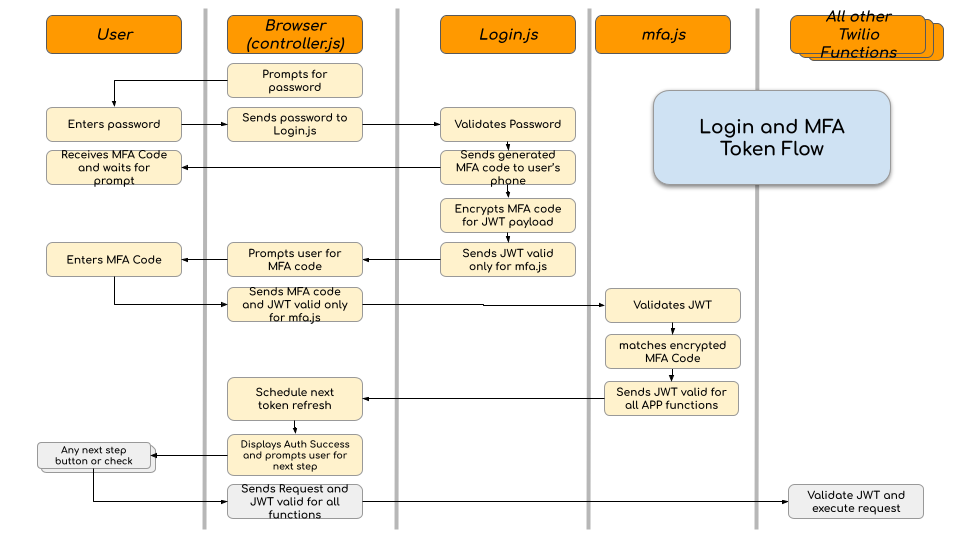

# Appointment Management with EHR Integration

*This document is intended to serve as a technical guide for customers who are interested in the architecture of the Appointment Management with EHR Integration application, and for understanding installation and customization possibilities.*

*Installation of this application is supported using the latest versions of Chrome and Firefox. Installation via Internet Explorer has not been officially tested and although issues are not expected, unforeseen problems may occur.*

- [Application Overview](#application-overview)
- [Architecture Highlights](#architecture-highlights)
- [Architecture Details](#architecture-details)
- [Installation](#installationxw)

---

## Application Overview

The Appointment Management with EHR Integration app packages together the core components of a deployable prototype for basic, two-way SMS communication between patient and provider using appointment information that is shared between the application and an integrated [Electronic Health Record (EHR)](https://www.healthit.gov/faq/what-electronic-health-record-ehr). This app is intended to support healthcare providers who are interested in building their own appointment management solution to understand what is possible using Twilio, and to accelerate the path to success by providing core building blocks and necessary workflows for implementing SMS appointment communication such as scheduling confirmations, reminders and cancelations.

The application includes the necessary Twilio components and an appointment reminder scheduling service, all pre-configured for deployment of a working prototype, ready to integrate directly with an EHR for demonstration of the possibilities (the separate step of EHR integration is required for the app to work). This application is not intended to be a production-ready app, but rather will allow you to install a functioning prototype into your test environment, establish a working EHR integration, and to explore how different Twilio components and functions can be leveraged to meet your needs.

Specifically, the Appointment Management with EHR Integration application implements the following capabilities:

- (*Outbound*) SMS notifications sent to patients based on appointment events occurring in the EHR:
  - booking/scheduling
  - rescheduling (date/time changes)
  - modification (location and/or provider)
  - confirmation
  - cancellation
  - noshows

- (*Inbound*) SMS response sent from patient "to the provider" (technically, to the EHR)
  - confirmation request
  - cancellation request

- (*Outbound*) SMS reminders sent to patient based on scheduled appointments (up to 2 reminders per patient per day)

*(For more details on appointment events supported by this application
, please reference the [EHR Integration Guide](https://twilio-cms-prod.s3.amazonaws.com/documents/EHR_Appointment_Management_App_EHR_Integration_Guide.pdf))*

---

## Architecture Highlights

This section provides a high-level overview of the application's architecture, including a discussion of the baked-in application components, the EHR integration that is necessary for the app to function, and an  Architecture diagram.


### Application Components

The application's architecture consists of 3 main components that interact closely together: Twilio Studio Flow, Twilio Functions.
- **Twilio Studio Flow** implements the SMS interaction with the patient (i.e. customizable message text and workflow) by taking configured parameters (from both the EHR messages and from your preferred message details configured in the Flow itself) and sending appropriate messages.
- **Twilio Functions** collect appointment events from the EHR and schedules future reminders using[ Twilio Scheduled Messaging](https://www.twilio.com/docs/sms/api/message-resource#schedule-a-message-resource)

### EHR Integration

This application is intended to sit next to your EHR, and will rely on a near real-time EHR integration interface coupled with the application's components, in order to function.  As long as your EHR integration interface can facilitate the real-time data exchange with the EHR, the app can integrate with a variety of integration methods including HL7 v2 messaging, FHIR, native EHR APIs, or available third-party integration APIs. Once scheduling messages are received by Twilio from your EHR, they are converted into JSON to complete the information flow through Twilio.

---

## Architecture Details

This section takes a deeper dive into the application's architecture by outlining the specific assets that are included in the app, what each of the application's components do, the functions and resources that are leveraged, as well as describing how events and dispositions are used to maintain appropriate appointment states within the system.

### Application Components

Below is a description of each of the components that you will find baked into the application (including Twilio c).

#### Twilio Studio Flow

This application includes a preconfigured Twilio Studio Flow, which implements:

- SMS interaction (outbound & inbound) with the patient per appointment event occurrence
- Scheduling and Sending messages
- Communicating to your EHR endpoint for 2-way (inbound to EHR) appointment requests (such as appointment cancelation & appointment confirmation requests)

*For more information on how the Studio Flow component works, check out [Twilio Studio Documentation](https://www.twilio.com/docs/studio).*

#### Twilio Service (Assets & Functions)
The application leverages service assets and functions
, which are part of Twilio Runtime.
Check out [Twilio Runtime Documentation](https://www.twilio.com/docs/runtime)
for additional information.

#### Assets
Static assets (files) of the application:

| Asset (under `/assets`) | Description |
| :-----------------------| :---------- |
|`/controller.js` |Javascript functions that control application behavior from `index.html`|
|`/index.html` |Main application page for application user|
|`/style.css` |Stylesheet used in `index.html`|
|`/studio-flow-template.json` |Deployable Studio Flow template|

#### Functions
Functions used in the application:

| Functions (under `/functions`) | Description |
| :----------------------------- | :---------- |
|`/get-datetime-parts.js` |Returns multiple datetime parts from ISO8601 string|
|`/helpers` |Shared functions used by other functions|
|`/scheduled-message-helper.js` |Helper functions used for message scheduling|
|`/message-booked.js` |Triggers booked appointment notification event|
|`/message-cancel.js` |Triggers cancel appointment request event|
|`/message-canceled.js` |Triggers canceled appointment notification event|
|`/message-confirm.js` |Triggers confirm appointment request event|
|`/message-confirmed.js` |Triggers confirmed appointment notification event|
|`/message-modified.js` |Triggers modified appointment notification event|
|`/message-noshowed.js` |Triggers noshowed appointment notification event|
|`/message-remind.js` |Triggers appointment reminder event|
|`/message-rescheduled.js` |Triggers rescheduled appointment notification event|
|`/simulation-parameters.js` |Gets customer parameters for display in simulation page |
|`/simulation-event.js` | Simulates events in the simulation page |


#### Multi-Factor Authentication

This application uses multi-factor authentication using JSON Web Tokens and a six digit MFA code. When you login to the application with a password, a six digit code is sent to the `ADMINISTRATOR_PHONE_NUMBER` which must be entered on the next prompt from the application. The logic uses two JSON Web Tokens (JWT). The `JWT for MFA` is generated by `login.js` and is valid for validating the MFA code entered by the user. This token contains the code as a payload in an encrypted form so that `mfa.js` can compare the code entered on the UI with that inside the token to confirm authentication. The following diagram shows the overall flow of token exchange between the browser and the Twilio functions. 



---

## Installation

This section details the requirements for a successful deployment and installation of the prototype application, including the necessary prerequisite steps, the variables that are needed to initiate installation, and the installation steps themselves.

### Prerequisites

The following prerequisites must be satisfied prior to installing this application.

#### Provision Twilio Account
You will need the following Twilio assets ready prior to installation:
- **Twilio account**
  - Create a Twilio account by signing up [here](https://www.twilio.com/try-twilio).
  - *(You will use your login information to get started with the Quick Deploy installation on the app's CodeExchange page)*
- **Twilio phone number** 
  - After provisioning your Twilio account, you will need to [purchase a phone number](https://www.twilio.com/console/phone-numbers/incoming) to use in the application.
  - Make sure the phone number is SMS enabled
  - *(This will be the number patients receive texts from)*

#### Docker Desktop

Install Docker desktop that includes docker compose CLI will be used to run the application installer locally on your machine.
Goto [Docker Desktop](https://www.docker.com/products/docker-desktop) and install with default options.
After installation make sure to start Docker desktop.


### Installation Steps


<em>(Installation of this application is supported on the latest versions of Chrome, Firefox, and Safari.
Installation via Internet Explorer has not been officially tested
and although issues are not expected, unforeseen problems may occur)</em>

Please ensure that you do not have any running processes
that is listening on port `3000`
such as development servers or another HLS installer still running.


#### Remove Docker Image

First, to ensure installation using the latest docker image, execute the following in your terminal window

```shell
docker image rm twiliohls/hls-pam-installer
```


#### Run Installer Docker Container

Replace `${TWILIO_ACCOUNT_SID}` and `${TWILIO_AUTH_TOKEN}` with that of your target Twilio account
and execute the following in your terminal window.

```shell
docker run --name hls-pam-installer --rm --publish 3000:3000  \
--env ACCOUNT_SID=${TWILIO_ACCOUNT_SID} --env AUTH_TOKEN=${TWILIO_AUTH_TOKEN} \
--interactive --tty twiliohls/hls-pam-installer
```

If running on Apple Silicon (M1 chip), add `--platform linux/amd64` option.


#### Open installer in browser & install

Open http://localhost:3000/installer/index.html

Fill in all required environment variables and/or change them to meet your needs.

Click `Deploy` to install the application to your Twilio account
and wait until installer indicates completion.


#### Terminate installer

To terminate installer:
- Enter Control-C in the terminal where `docker run ...` was executed
- Stop the `hls-pam-installer` docker container via the Docker Desktop
